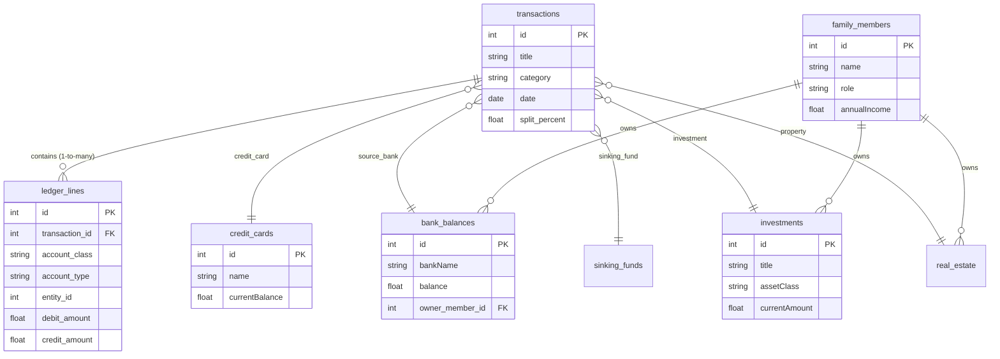

# Database Schema

The application uses **SQLite** in WAL (Write-Ahead Logging) mode, managed via `better-sqlite3`. The database uses a strict double-entry accounting model via the `ledger_lines` table.

## Core Financial Tables

### `transactions`
The metadata table for every financial event.
- **Columns**: `id`, `title`, `category`, `date`, `isTaxDeductible`, `receiptUrl`
- **Foreign Keys**: Links out to numerous specific asset/liability rows (e.g., `propertyId`, `linked_loan_id`, `investment_id`, `sinking_fund_id`, `credit_card_id`, `fd_id`, `gold_id`, `nps_id`, `source_bank_id`).
- **Splitting Logic**: Contains `split_percent`, `split_amount`, and `joint_bank_id` for multi-party/split transactions.

### `ledger_lines`
The double-entry accounting foundation. Every transaction has at least two ledger lines (a debit and a credit).
- **Columns**: `id`, `transaction_id`, `account_class`, `account_type`, `entity_id`, `debit_amount`, `credit_amount`
- **Account Classes**: 
  - `Asset` (e.g., `bank`, `operating`) -> Normal Balance: **Debit** (+Debit, -Credit)
  - `Liability` (e.g., `loan`, `credit_card`) -> Normal Balance: **Credit** (-Debit, +Credit)
  - `Revenue` (Income) -> Normal Balance: **Credit** (-Debit, +Credit)
  - `Expense` -> Normal Balance: **Debit** (+Debit, -Credit)

## Asset Management Tables

### `bank_balances`
- **Purpose**: Point-in-time snapshots of cash accounts.
- **Columns**: `id`, `bankName`, `balance`, `asOfDate`, `owner_member_id`

### `investments`, `investment_lots`, `sip_purchases`
- **`investments`**: Tracks mutual funds, equities, etc. Includes ROI, target amount, NAV.
- **`investment_lots`**: Tracks individual purchases to compute cost basis.
- **`sip_purchases`**: Tracks systematic investment plan (recurring) purchases.

### `real_estate`
- **Columns**: `id`, `title`, `propertyType`, `baseValue`, `expectedRent`, `currentMarketValue`, `linkedLoanId`.

### `fixed_deposits` & `nps_accounts` & `gold_holdings`
- Custom tables tracking specific Indian/standard asset classes with maturity dates, interest rates, weights, etc.

## Financial Planning Tables

### `sinking_funds`
- Savings goals with a target date and target amount.

### `budgets`
- Monthly limits by `category`.

### `savings_rules` & `pending_sweeps`
- Rules engine for sweeping excess cash into investments.

## People & Net Worth

### `family_members`
- Tracks the family tree, age, target savings, income, and life insurance targets.

### `net_worth_snapshots` & `net_worth_history`
- Automated point-in-time calculations of Assets vs Liabilities.

### `nominees`
- Estate planning mappings connecting family members to specific assets.

## Utility Tables
- `reminders`: Recurring or one-off financial reminders.
- `audit_logs`: Tracks critical CRUD operations for history.
- `documents`: Document vault metadata tracking expiries.
- `app_settings`: Key-value store for app configuration.

## Entity-Relationship Diagram (ERD)

---
**Tags**: #database #schema #sqlite #ledger
