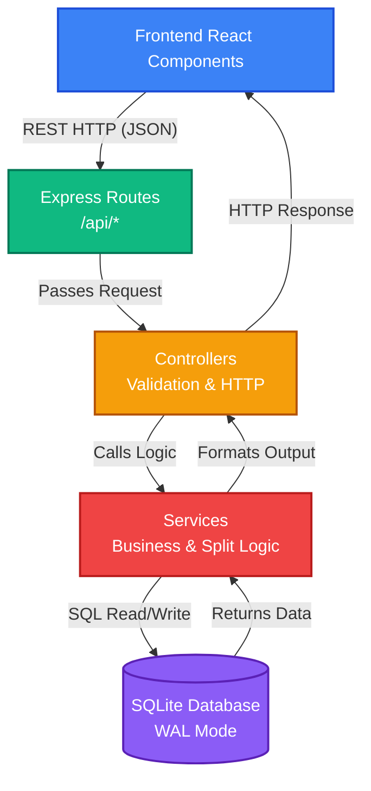

# Application Architecture Overview

Welcome to the **Financial Assistant** developer documentation vault! This Obsidian vault meticulously maps the entire full-stack application.

## 🏗️ System Architecture
The application follows a standard Client-Server architecture:
- **Frontend**: React.js (Component-based architecture)
- **Backend**: Node.js + Express.js (REST API, Service-Controller-Route pattern)
- **Database**: SQLite (WAL mode for concurrency), utilizing a strict **Double-Entry Ledger** accounting system.

## 🗂️ Documentation Hubs

### 1. Database & Core Data Model
Start here to understand how financial data is stored and balanced.
- [[Database_Schema]]: The complete SQLite schema, including `transactions`, `ledger_lines`, `bank_balances`, and the core accounting rules.

### 2. Backend API & Logic
The backend is split into REST routes, request-handling controllers, and business-logic services.
- **[[Backend/Routes/Index|Routes]]**: The entry points for all frontend requests.
- **[[Backend/Controllers/Index|Controllers]]**: Middlemen that handle validation and HTTP response formatting.
- **[[Backend/Services/Index|Services]]**: The brain of the application. Services directly interact with the database and contain complex mathematical and financial logic.

### 3. Frontend UI
The React frontend is divided into domain-specific hubs and modular components.
- **[[Frontend/Components/Index|Components]]**: Individual UI elements (e.g. `WealthHub`, `ProtectionHub`, `LedgerTable`, `TransactionModal`).
- **[[Hooks]]**: Custom React hooks handling state (e.g., `useLedgerState`, `useAmortizationEngine`).

## 📚 Engineering Playbooks
Beyond just mapping the codebase, this vault contains standard operating procedures and business logic definitions.
- **[[Financial_Glossary]]**: The single source of truth for all domain terminology (e.g., Sinking Funds vs Budgets, Double-Entry rules).
- **[[Cookbook]]**: The developer guide containing step-by-step recipes for adding new asset classes, React components, and database migrations.

## 🔄 Core Workflows
(Coming Soon) Detailed flowcharts mapping the lifecycle of complex operations, such as:
- *Adding a Transaction & Balancing the Ledger*
- *Net Worth Calculation Sweep*
- *Amortization Engine Execution*

---
**Tags**: #overview #architecture #documentation
