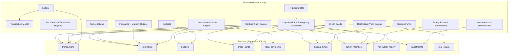

# 🏛️ Financial Assistant — Expert Strategy Blueprint

> A meticulous examination of your existing system and 12 novel, implementable ideas to transform it into an institutional-grade personal finance command center.

---

## Part I: Current System Audit

After exhaustively examining every component, database table, API route, and computation engine in your Financial Assistant, here is what you currently have:

### Existing Architecture Map



### What You Already Do Well

| Capability | Assessment |
|---|---|
| **Double-entry-style liquidity math** | Your Liquidity Hub correctly subtracts locked capital (sinking funds, endowments, investments) from net cash — this is rare in personal tools |
| **Loan amortization with prepayment simulation** | The interest-destruction calculator is genuinely sophisticated |
| **Cross-matrix Sentinel auditing** | Detecting structural deficits and ghost subscriptions across 7 tables simultaneously is institutional-level |
| **Indian tax regime comparison** | Old vs New regime with real slab math — practical and actionable |
| **FIRE projection** | Real-return (Nifty50 − CPI) forward simulation with investable surplus |
| **Emergency drawdown algorithm** | Prioritized waterfall: idle cash → farthest sinking funds → endowments — this is smart |

### What's Missing — The Gaps This Blueprint Fills

| Gap | Why It Matters |
|---|---|
| **No forward cash flow forecasting** | You track what *happened* but can't see what's *coming* in the next 30/60/90 days |
| **No debt optimization strategy** | You have loan tracking but no avalanche vs. snowball comparison engine |
| **No inflation erosion visibility** | You use a static 6% in FIRE but don't show how inflation is actually destroying your purchasing power over time |
| **No opportunity cost awareness** | Money sitting idle in sinking funds or checking has invisible yield drag |
| **No financial stress testing** | What happens if you lose a job, or a tenant stops paying? No scenario modeling |
| **No automated savings rules** | Everything is manual — no "if X happens, auto-route Y to Z" |
| **No income diversification analysis** | No visibility into single-source dependency risk |
| **No lifestyle creep detection** | Budget limits exist but there's no drift analysis month-over-month |
| **No goal conflict resolution** | Competing goals (FIRE vs. child endowment vs. loan prepayment) have no arbitration engine |
| **No tax-loss harvesting automation** | You mention LTCG harvesting in Investments but don't execute on it |
| **No emergency fund adequacy math** | No calculation of "how many months can you survive" |
| **No rupee-cost averaging analysis** | SIP tracking exists but no DCA analytics |

---

## Part II: The 12 Novel Feature Proposals

---

### 💡 Idea 1: Cash Flow Forecasting Engine (Temporal Liquidity Radar)

**The Problem:** You currently see a snapshot — "Free Idle Cash is ₹X right now." But you have no idea if you'll have ₹X next month, because EMIs, insurance premiums, subscriptions, and expected rents all have known future dates.

**The Solution:** A 90-day forward projection engine that reads every recurring obligation (loans, insurance, subscriptions) and every expected income (salaries, rents) to plot a day-by-day cash flow curve.

**Why It's Novel:** Most budgeting apps show a monthly summary. This shows *daily granularity* — you'll see exactly which day you'll hit a cash crunch and can pre-position capital.

**Implementation Blueprint:**

```
Backend:
├── GET /api/forecast?days=90
│   ├── Read all reminders (loans=monthly, insurance=yearly/monthly, subs=monthly)
│   ├── Read all real_estate (expectedRent per property per month)
│   ├── Read family_members (annualIncome / 12 for providers)
│   ├── Read credit_cards (dueDate obligations)
│   ├── Project each into daily buckets for next N days
│   └── Return: { dates[], projectedBalance[], events[] }

Frontend:
├── CashFlowForecast.jsx
│   ├── Area chart showing projected balance over time
│   ├── Red zone markers where balance drops below emergency threshold
│   ├── Hover to see what event causes each dip/spike
│   └── "Danger Zone" alerts for days where projected balance < 0
```

**Financial Impact:** Prevents overdraft situations and allows strategic timing of large purchases.

---

### 💡 Idea 2: Debt Avalanche vs. Snowball Optimizer

**The Problem:** You have a loan amortization engine that analyzes loans individually. But you have no *strategy engine* that compares payoff approaches across *all* loans simultaneously.

**The Solution:** A dual-simulation that takes your total free monthly surplus and models two strategies:
- **Avalanche:** Pay minimums on all, throw surplus at the highest interest rate loan
- **Snowball:** Pay minimums on all, throw surplus at the smallest balance loan

Then display a side-by-side comparison: total interest paid, months to freedom, and a psychological "wins" timeline.

**Implementation Blueprint:**

```
Backend:
├── GET /api/debt-strategy
│   ├── Fetch all loans (reminders WHERE category='loan')
│   ├── Fetch free liquidity to determine monthly surplus
│   ├── Run avalanche simulation (sort by interestRate DESC)
│   ├── Run snowball simulation (sort by remainingBalance ASC)  
│   └── Return: { avalanche: {months, totalInterest, timeline[]}, snowball: {same} }

Frontend:
├── DebtOptimizer.jsx
│   ├── Split panel: Avalanche vs Snowball with glowing winner badge
│   ├── Stacked bar chart showing payoff timeline for each loan
│   ├── Total interest saved differential in big bold text
│   └── "Quick Win Timeline" showing when each loan gets killed
```

**Financial Impact:** On a typical ₹50L combined loan portfolio, choosing avalanche over snowball can save ₹2-5L in interest.

---

### 💡 Idea 3: Inflation Erosion Tracker (Real Purchasing Power Dashboard)

**The Problem:** You track nominal values everywhere. ₹10L in savings feels great — until you realize it was worth ₹10L last year and is now worth ₹9.4L in real terms at 6% CPI.

**The Solution:** An overlay dashboard that converts every major balance (investments, sinking funds, endowments, idle cash) into inflation-adjusted "real" values. Show a "silent tax" counter — how much purchasing power you've lost this month/year/lifetime to inflation.

**Implementation Blueprint:**

```
New DB Table:
├── inflation_tracker
│   ├── id, snapshotDate, nominalTotal, realTotal, cpiRate

Backend:
├── GET /api/inflation-dashboard
│   ├── Sum all assets at nominal value
│   ├── Apply compounding CPI erosion from earliest transaction date
│   ├── Calculate: "You have ₹X but it can only buy what ₹Y could a year ago"
│   └── Return: { nominalWealth, realWealth, erosionThisYear, erosionLifetime }

Frontend:
├── InflationRadar.jsx
│   ├── Dual-line chart: Nominal vs Real wealth over time
│   ├── "Silent Tax" counter showing daily/monthly erosion
│   ├── Per-asset breakdown: which assets beat inflation, which didn't
│   └── Alert: "Your sinking fund for Car (₹3L) will only be worth ₹2.66L by target date"
```

**Financial Impact:** Creates urgency to move idle cash into inflation-beating instruments.

---

### 💡 Idea 4: Opportunity Cost Calculator (Idle Money Radar)

**The Problem:** ₹2L sitting in a sinking fund for 18 months earns 0%. If it were in a liquid mutual fund at 6%, it would have earned ₹18,540. This invisible cost is never surfaced.

**The Solution:** For every pool of capital (sinking funds, excess idle cash, checking balance), calculate what it *would* have earned if invested at a benchmark rate. Show the "cost of not investing" in real-time.

**Implementation Blueprint:**

```
Backend:
├── GET /api/opportunity-cost
│   ├── For each sinking fund: (currentAmount × benchmarkRate × daysActive / 365)
│   ├── For idle cash: (freeLiquidity × liquidFundRate × 1/12) per month
│   ├── For endowments in savings account vs equity: delta
│   └── Return: { totalOpportunityCost, breakdown[] }

Frontend:
├── OpportunityCostRadar.jsx
│   ├── Each capital pool as a card with "you're leaving ₹X on the table"
│   ├── Aggregate "Ghost Yield Lost" counter (animated, counting up)
│   ├── Recommendations: "Move Car Fund to Liquid MF, earn ₹847/month"
│   └── Quick-action buttons to route capital to investment-grade instruments
```

**Financial Impact:** Surfaces ₹5,000–₹50,000+ per year in invisible yield drag.

---

### 💡 Idea 5: Financial Stress Test Simulator (Scenario Warfare Engine)

**The Problem:** Your current system assumes all income continues. It doesn't model: "What if I lose my job for 6 months?" or "What if tenant #2 defaults?" or "What if an EMI rate increases by 2%?"

**The Solution:** A scenario-based stress testing engine where you pick a shock (job loss, medical emergency, interest rate hike, tenant default, market crash) and the system propagates the impact across your entire financial graph.

**Implementation Blueprint:**

```
Backend:
├── POST /api/stress-test
│   ├── Body: { scenario: 'job_loss', duration: 6, params: {} }
│   ├── Clone current financial state
│   ├── Apply shock:
│   │   ├── job_loss: Zero out provider income for N months
│   │   ├── medical: Inject large unexpected expense
│   │   ├── rate_hike: Increase all loan EMIs by X%
│   │   ├── tenant_default: Zero out rental income for N months
│   │   └── market_crash: Reduce investment values by X%
│   ├── Run forward simulation: Can you survive? When do you go negative?
│   └── Return: { survivalMonths, liquidityTimeline[], firstCrisisDate, requiredBuffer }

Frontend:
├── StressTest.jsx
│   ├── Scenario selector with dramatic icons and descriptions
│   ├── Adjustable parameters (duration, severity slider)
│   ├── Result: survival timeline chart with crisis markers
│   ├── "Your system collapses on Day 47" or "You survive with ₹X margin"
│   └── Prescription: "Increase emergency fund by ₹Y to survive this scenario"
```

**Financial Impact:** This is how institutional risk managers think. Converts anxiety into actionable buffer targets.

---

### 💡 Idea 6: Automated Savings Rules Engine (If-Then Capital Router)

**The Problem:** Every capital movement in your app is manual. You click "Route Capital" or "Contribute" by hand. There's no automation.

**The Solution:** A rule engine where you define triggers and actions:
- "If idle cash exceeds ₹50,000, auto-route ₹10,000 to Car Fund"
- "If salary income detected, auto-allocate 20% to investments"
- "On the 1st of every month, move ₹5,000 to Emergency Fund"

These rules evaluate on every transaction insertion or on a schedule.

**Implementation Blueprint:**

```
New DB Table:
├── savings_rules
│   ├── id, name, trigger_type ('threshold'|'schedule'|'income_detected')
│   ├── trigger_value (e.g., 50000 for threshold, 'salary' for income category)
│   ├── action_type ('route_to_sinking'|'route_to_investment'|'route_to_endowment')
│   ├── action_target_id (sinking fund ID, investment ID, etc.)
│   ├── action_amount (fixed amount or percentage)
│   ├── is_active BOOLEAN
│   └── last_executed TEXT

Backend:
├── CRUD /api/savings-rules
├── Internal: evaluateRules() — called after every POST /api/transactions
│   ├── Check threshold rules: if freeLiquidity > trigger_value → execute
│   ├── Check income rules: if new transaction is income in category → execute
│   └── Cron: monthly schedule rules

Frontend:
├── SavingsRules.jsx
│   ├── Visual rule builder with dropdowns: "When [trigger] → Then [action]"
│   ├── Active rules dashboard with last execution timestamp
│   ├── Execution log showing what was auto-routed and when
│   └── Dry-run simulator: "If this rule existed last month, it would have moved ₹X"
```

**Financial Impact:** Behavioral economics proves that automating savings increases wealth accumulation by 30-40%. This is the single highest-ROI feature you can build.

---

### 💡 Idea 7: Income Diversification Radar (Concentration Risk Scanner)

**The Problem:** If 90% of your income comes from one salary, you have catastrophic single-point-of-failure risk. Your app doesn't measure this.

**The Solution:** Analyze all income sources (salary, rental from each property, investment dividends, side income) and compute a Herfindahl-Hirschman Index (HHI) — the same concentration metric used by antitrust regulators.

**Implementation Blueprint:**

```
Backend:
├── GET /api/income-diversification
│   ├── Aggregate income by source: salary, each property's rent, investment interest
│   ├── Calculate HHI: sum of (share_i)^2 for each source
│   ├── HHI > 0.25 = HIGH concentration risk
│   ├── HHI 0.15-0.25 = MODERATE
│   ├── HHI < 0.15 = DIVERSIFIED
│   └── Return: { hhi, sources[], riskLevel, recommendation }

Frontend:
├── IncomeDiversification.jsx
│   ├── Donut chart with income source breakdown
│   ├── HHI gauge meter (like a speedometer)
│   ├── Risk level badge with color coding
│   └── Strategic recommendations: "Adding ₹5K/month freelance income would drop HHI to 0.18"
```

**Financial Impact:** Quantifies the invisible risk of income concentration and motivates side-income development.

---

### 💡 Idea 8: Lifestyle Creep Detector (Expenditure Drift Analyzer)

**The Problem:** Budget limits exist but are static. If your grocery budget is ₹15K and you've been at ₹14.5K for 6 months, then suddenly you're at ₹16K, ₹17K, ₹18K — that's lifestyle creep. Nobody notices until it's too late.

**The Solution:** A trailing 6-month moving average analyzer for each expense category that detects upward drift and flags it before it becomes structural.

**Implementation Blueprint:**

```
Backend:
├── GET /api/lifestyle-creep
│   ├── For each expense category, calculate monthly spend for last 6 months
│   ├── Compute: linear regression slope (trend direction)
│   ├── If slope > 5% month-over-month consistently → FLAG
│   ├── Calculate: "At this drift rate, your annual spend will increase by ₹X"
│   └── Return: { categories: [{ name, monthlyTrend[], slope, projection, alert }] }

Frontend:
├── LifestyleCreepDetector.jsx
│   ├── Sparkline charts per category showing 6-month trend
│   ├── Red "CREEP DETECTED" badges on categories with positive slope
│   ├── Projection: "If unchecked, Dining will cost ₹24K more this year"
│   └── Historical comparison: "You spent 23% more on Transport vs 6 months ago"
```

**Financial Impact:** Lifestyle creep is the #1 silent wealth destroyer for middle-to-upper income earners. Detecting it automatically is transformative.

---

### 💡 Idea 9: Goal Conflict Resolution Engine (Financial Arbitration Matrix)

**The Problem:** You want to: (a) prepay your home loan aggressively, (b) max out your PPF, (c) fund your child's endowment, and (d) build a car sinking fund. But your free cash is ₹25K/month. These goals *compete*. There's no system to arbitrate.

**The Solution:** A priority-weighted optimizer that takes all active goals, their deadlines, their penalty for under-funding, and your available surplus — then computes the mathematically optimal allocation.

**Implementation Blueprint:**

```
Backend:
├── POST /api/optimize-allocation
│   ├── Collect all active goals:
│   │   ├── Loans (benefit = interest saved by prepaying)
│   │   ├── PPF (benefit = 7.1% guaranteed + tax saving)
│   │   ├── SIPs (benefit = expected 12% return)
│   │   ├── Sinking Funds (benefit = avoiding emergency borrowing)
│   │   ├── Endowments (benefit = child's future, time-critical)
│   ├── For each goal, compute: ROI if funded vs. penalty if not
│   ├── Apply constrained optimization (maximize total ROI under cash constraint)
│   └── Return: { optimalAllocation: [{goal, recommended₹, reasoning}], totalReturn }

Frontend:
├── GoalArbitrator.jsx
│   ├── Input: available monthly surplus (auto-filled from liquidity)
│   ├── Visual: Sankey diagram showing money flow from surplus → goals
│   ├── Each goal card: "Recommended: ₹X/month" with ROI justification
│   ├── Slider to adjust priorities (e.g., "I value debt freedom more")
│   └── "What-if": "If you had ₹5K more, here's how allocation changes"
```

**Financial Impact:** Eliminates emotional decision-making. Could improve total portfolio returns by 1-3% annually through optimal capital routing.

---

### 💡 Idea 10: Tax-Loss Harvesting Automation (LTCG Optimization Engine)

**The Problem:** Your Investments page mentions "sell and re-buy ₹1.25L to reset basis legally" but there's no actual mechanism to track unrealized gains, identify harvesting opportunities, or calculate the optimal harvest amount.

**The Solution:** Track cost basis for each SIP/investment, compute unrealized gains in real-time, and alert you when approaching the ₹1.25L LTCG tax-free threshold with specific sell-and-rebuy instructions.

**Implementation Blueprint:**

```
New DB Table:
├── investment_lots
│   ├── id, investment_id, purchaseDate, purchaseAmount, units, costBasis

Backend:
├── GET /api/tax-harvest
│   ├── For each investment lot, calculate unrealized gain (current - costBasis)
│   ├── Sum total unrealized LTCG (lots held > 1 year)
│   ├── If total < ₹1,25,000: "You have ₹X headroom"
│   ├── If total > ₹1,25,000: "Harvest NOW — sell ₹Y worth to reset basis"
│   ├── Calculate exact tax saved: (excess × 12.5%)
│   └── Return: { unrealizedLTCG, harvestHeadroom, optimalSellAmount, taxSaved }

Frontend:
├── TaxHarvester.jsx
│   ├── Big gauge: "LTCG Utilized: ₹87,000 / ₹1,25,000"
│   ├── Lot-by-lot breakdown with gain/loss per lot
│   ├── One-click "Generate Harvest Plan" button
│   └── Calendar: "Best time to harvest is before March 31"
```

**Financial Impact:** Saves ₹15,625 per year (₹1.25L × 12.5% LTCG tax) completely legally. Over 20 years = ₹3.1L+ saved.

---

### 💡 Idea 11: Emergency Fund Adequacy Matrix (Survival Capacity Meter)

**The Problem:** You have an Emergency Drawdown feature, but no analysis of *how adequate* your emergency reserves are. Financial planners recommend 6-12 months of expenses as a buffer. You don't measure this.

**The Solution:** Calculate your true monthly burn (all expenses + EMIs + insurance + subscriptions), divide your liquid assets by this number, and display a "months of survival" metric with clear adequacy bands.

**Implementation Blueprint:**

```
Backend:
├── GET /api/emergency-adequacy
│   ├── Calculate true monthly burn:
│   │   ├── Average monthly expenses (last 6 months from transactions)
│   │   ├── + Monthly EMIs (from loans)
│   │   ├── + Monthly insurance premiums (from insurance reminders)
│   │   ├── + Monthly subscriptions
│   │   = Total Monthly Obligation (TMO)
│   ├── Calculate liquid reserves:
│   │   ├── Free idle cash
│   │   ├── + Liquid sinking funds (target > 6 months away)
│   │   = Total Liquid Reserves (TLR)
│   ├── Months of survival = TLR / TMO
│   └── Return: { tmo, tlr, survivalMonths, adequacy, targetGap }

Frontend:
├── EmergencyAdequacy.jsx
│   ├── Circular progress ring: "4.2 Months" (target: 6-12 months)
│   ├── Red (<3), Yellow (3-6), Green (6-9), Gold (9-12), Platinum (12+)
│   ├── Breakdown: "Your monthly burn is ₹78,000 across 4 channels"
│   └── Gap analysis: "You need ₹1,56,000 more to reach 6-month safety"
```

**Financial Impact:** Provides the single most important personal finance metric — "how long can I survive without income?"

---

### 💡 Idea 12: Rupee Cost Averaging Analyzer (SIP Intelligence Dashboard)

**The Problem:** You track SIP balances but don't analyze the *behavior* of your rupee-cost averaging. Are your SIPs actually reducing your average cost? How does your entry price compare to lump-sum alternatives?

**The Solution:** For each SIP, track individual purchase events and compute: average cost basis, cost variance, and a DCA vs lump-sum comparison to prove (or disprove) the SIP advantage.

**Implementation Blueprint:**

```
New DB Table:
├── sip_purchases
│   ├── id, investment_id, date, amount, nav_price, units_purchased

Backend:
├── GET /api/sip-analytics/:id
│   ├── Calculate weighted average cost per unit across all purchases
│   ├── Compare to: if lump sum was invested on day 1
│   ├── Compute: cost variance (how much DCA smoothed your entry)
│   ├── Streak tracker: consecutive months funded
│   └── Return: { avgCost, lumpSumComparison, costVariance, streak, totalUnits }

Frontend:
├── SIPAnalytics.jsx
│   ├── Per-SIP card with: avg cost, current NAV, gain/loss
│   ├── Chart: purchase price dots over NAV line (visual DCA proof)
│   ├── "Your SIP saved you ₹X vs lump sum" or "Lump sum would've been better"
│   ├── Consistency score: "You've maintained your SIP for 14/14 months"
│   └── Projection: "At current pace, this SIP will be worth ₹X in 5 years"
```

**Financial Impact:** Builds conviction in systematic investing, reduces panic-selling behavior.

---

## Part III: Prioritized Implementation Roadmap

| Priority | Feature | Effort | Financial Impact | Dependencies |
|:---:|---|:---:|:---:|---|
| 🔴 1 | Emergency Fund Adequacy Matrix | Low | **Critical** | None — uses existing data |
| 🔴 2 | Cash Flow Forecasting Engine | Medium | **High** | None — reads existing reminders/recurrences |
| 🔴 3 | Financial Stress Test Simulator | Medium | **High** | Builds on #2 forecasting |
| 🟡 4 | Lifestyle Creep Detector | Low | **High** | None — pure transaction analysis |
| 🟡 5 | Debt Avalanche/Snowball Optimizer | Medium | **High** | None — reads existing loans |
| 🟡 6 | Automated Savings Rules Engine | High | **Very High** | New DB table + trigger system |
| 🟢 7 | Opportunity Cost Calculator | Low | **Medium** | None — pure math overlay |
| 🟢 8 | Inflation Erosion Tracker | Low | **Medium** | None — pure math overlay |
| 🟢 9 | Income Diversification Radar | Low | **Medium** | None — reads existing data |
| 🟢 10 | Goal Conflict Resolution Engine | High | **Very High** | Reads all goal tables |
| 🟢 11 | Tax-Loss Harvesting Automation | Medium | **High** | New DB table for lots |
| 🟢 12 | SIP DCA Analyzer | Medium | **Medium** | New DB table for purchases |

---

## Part IV: Quick Wins You Can Build Today

These require **zero new database tables** and can be computed from existing data:

1. **Emergency Adequacy** — just divide free cash by average monthly expenses
2. **Lifestyle Creep** — 6-month trailing average of existing transaction data
3. **Opportunity Cost** — multiply idle balances by benchmark rates
4. **Income Diversification** — HHI calculation from income transactions
5. **Inflation Erosion** — apply 6% CPI to all nominal values

> [!TIP]
> I recommend starting with **Emergency Fund Adequacy** (Idea 11) and **Cash Flow Forecasting** (Idea 1) — they're the highest impact-to-effort ratio and use only existing data.

---

*Tell me which ideas resonate with you, and I'll build them into your application immediately.*
